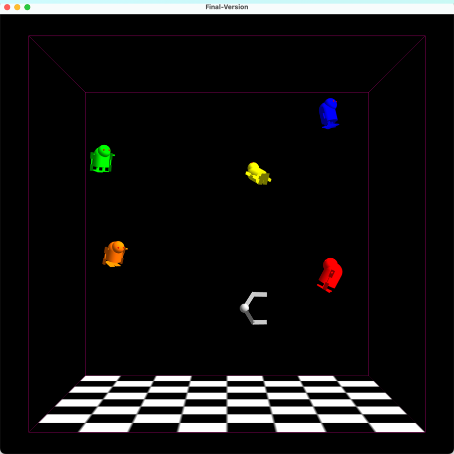
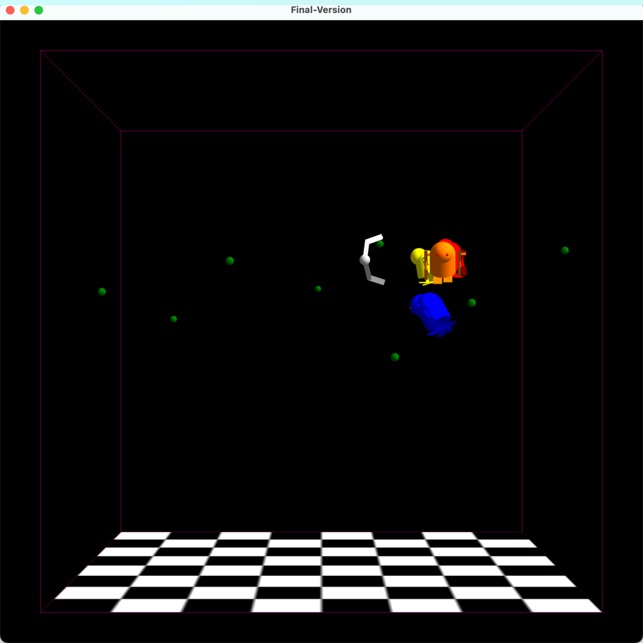
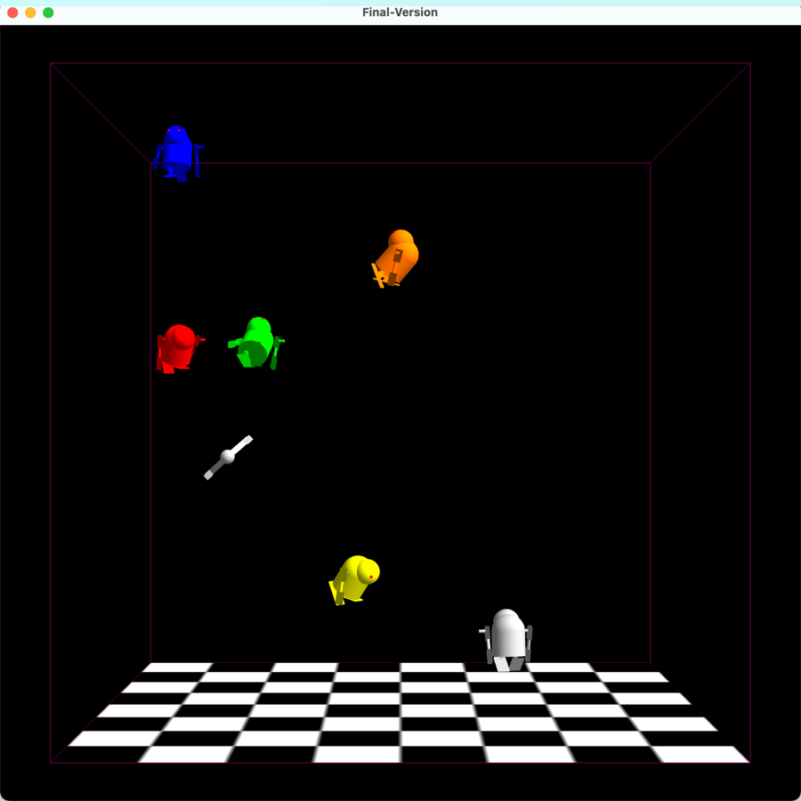

# PA3_Fall2024: Creature Modeling and Animation

## Table of Contents
- [Introduction](#introduction)
- [Differences and New Additions](#Differences and New Additions)
- [Features](#features)
  - [Creature Modeling (Predator/Prey)](#creature-modeling-predatorprey)
  - [Model Animation](#model-animation)
  - [Collision Detection & Reaction](#collision-detection--reaction)
  - [Orientation](#orientation)
  - [Additional Features for Extra Credit](#additional-features-for-extra-credit)
- [Usage](#usage)
- [Files Overview](#files-overview)
- [Error Handling](#error-handling)


## Introduction
This project extends a 3D vivarium simulation with creature modeling, animation, and interactive behaviors. Polyhedral creatures are introduced with unique features and animations, including predator-prey interactions, collision detection within boundaries, and group dynamics. This repository is organized with modular components for easy maintenance and extension.
It simulates a 3D vivarium with animated polyhedral creatures that interact and move within a confined space. Predators and prey are visually distinguished, and the simulation includes boundary containment, orientation, and potential group behaviors. The design suggests a visually engaging environment for studying simulated creature behaviors and interactions.
The techniques used in this vivarium include but are not limited to the following:
1. Using quaternion to perform arbitrary angle rotation.
2. Tank wall as potential functions so the fish will try to turn when approaching the edges.
3. Prey will try to keep group movement.
4. The predator  will try to eat the prey, and the prey will try to eat the food.
5. the richness of multiple prey.


## Differences and New Additions

### 1. **Creature Modeling (Predator/Prey)**
   - **Goal**: Define a predator and prey with distinct features and moving parts.
   - **Updates**:
     - Added predator and prey models with color and design differentiation.
     - Integrated polyhedral components from previous assignments or newly created parts.
     - **New Variables**: 
       - `isPredator` or similar flag to classify creatures.
       - `movingParts` for predators/prey to control limb or body part animations.
     - **Error Handling**:
       - Ensure parts are rendered correctly and avoid overlap in initial positioning.

### 2. **Model Animation**
   - **Goal**: Add animations to creature models using periodic transformations.
   - **Updates**:
     - Created an `animationUpdate` function under “TODO 2” to apply transformations like limb or wing flapping.
     - **New Variables**: 
       - `animationCycle` or `moveInterval` to track animation steps.
       - `transformationParams` for periodic transformations.
     - **Error Handling**:
       - Handle edge cases where animations might result in unnatural movements or rotations.

### 3. **Collision Detection & Reaction**
   - **Goal**: Implement collision detection within a 3D tank for predator-prey interactions and boundary containment.
   - **Updates**:
     - Introduced bounding spheres or boxes to detect when creatures reach the tank’s boundary.
     - Added predator-prey interactions where prey disappear upon being caught.
     - **New Variables**:
       - `boundaryBox` or `boundingSphere` for boundary constraints.
       - `collisionFlag` to trigger responses upon collision.
     - **Error Handling**:
       - Prevent objects from clipping outside the tank.
       - Handle simultaneous collisions gracefully to avoid unexpected behaviors.

### 4. **Orientation**
   - **Goal**: Orient creatures to face their movement direction.
   - **Updates**:
     - Implemented under “TODO 4” using `rotateDirection` to align creature orientation with its movement.
     - **New Variables**:
       - `directionVector` to indicate movement orientation.
       - `rotationAngle` for adjusting the creature’s facing direction.
     - **Error Handling**:
       - Ensure creatures rotate smoothly without abrupt jumps.
       - Avoid cumulative errors in orientation adjustments.

### 5. **Additional Features for Extra Credit**
   - **Goal**: Enhance the simulation with food particles and group behaviors.
   - **Updates**:
     - Added `foodParticle` entities within the vivarium that creatures can consume.
     - Implemented group behavior (flocking) using the Boids algorithm for more natural interactions.
     - **New Variables**:
       - `foodList` for managing food particles in the environment.
       - `boidBehaviorParams` to control group dynamics.
     - **Error Handling**:
       - Manage food particle generation to avoid overcrowding.
       - Handle complex group dynamics without performance degradation.


## Features

### Creature Modeling (Predator/Prey)
- **Predator**: A polyhedral model with distinct coloring and at least two moving parts, such as limbs or wings.
- **Prey**: Two polyhedral models with simpler structures and unique coloration. Each prey has one moving part.
- **Differentiation**: The predator and prey models are distinguished by their color schemes and designs, ensuring clear front and back orientations.

### Model Animation
- **Periodic Transformations**: Animations are handled in `animationUpdate` (located at TODO 2), using cyclic transformations to simulate creature movements, such as limb flapping.
- **Parameters**:
  - `moveInterval`: Controls animation timing.
  - `transformationParams`: Stores parameters for animation transformations.

### Collision Detection & Reaction
- **Boundary Containment**: Creatures remain within the 3D tank environment through bounding sphere or box collision detection.
- **Predator-Prey Interaction**: When the predator catches prey, the prey disappears, simulating a successful capture.
- **Same-Species Collision Reflection**: Collision reflection is applied when creatures of the same type collide to prevent overlap.

### Orientation
- **Movement Direction**: Creatures align their orientation with their movement direction, implemented in `rotateDirection` (TODO 4).
- **Parameters**:
  - `directionVector`: Vector indicating the direction of movement.
  - `rotationAngle`: Specifies the angle needed to adjust creature orientation.

### Additional Features for Extra Credit
- **Food Particles**: Food particles spawn randomly within the vivarium, providing additional interaction opportunities. Implemented in `animationUpdate` (TODO 5).
- **Group Behavior**: Flocking behavior is achieved using Boids algorithms, creating realistic group movements and interactions.
- **Upright Orientation**: Creatures are programmed to remain upright to improve orientation clarity.

## Usage

1. **Setup Environment**: Ensure dependencies are installed using either `environment.yml` or `requirements.txt`.
   ```bash
   # Using environment.yml
   conda env create -f environment.yml
   conda activate PA3_Fall2024

   # Using requirements.txt
   pip install -r requirements.txt
   ```
2. **Run Simulation**: Launch the simulation using the main script (e.g., `Sketch.py`).
   ```bash
   python Sketch.py
   ```

3. **Interaction Controls**:
   - **Rotate**: Use mouse drag to rotate the view.
   - **Zoom**: Use scroll to zoom in/out.
   - **Animation Control**: Press designated keys to start/stop creature animations.

Press F to add several food. Both the predator and prey will try to eat it.

Press R to resatrt Game.


## Files Overview

| File                      | Description                                                                                  |
|---------------------------|----------------------------------------------------------------------------------------------|
| `GLUtility.py`            | Contains helper functions for OpenGL operations.                                            |
| `CanvasBase.py`           | Base class for setting up a graphical canvas.                                               |
| `ModelTank.py`            | Defines the tank environment for creature interactions.                                     |
| `Shapes.py`               | Contains basic shape definitions for polyhedral models.                                     |
| `Vivarium.py`             | Manages the vivarium environment, including boundary and collision logic.                   |
| `Creature Models`         | Defines the predator and prey structures, including moving parts and animations.            |
| `Animation.py`            | Handles periodic transformations and animations for creatures.                              |
| `Collision Logic`         | Implements boundary and interaction collision detection.                                    |
| `README.md`               | Project overview and usage instructions.                                                    |
| `DisplayableSphere.py`    | Class for rendering a displayable sphere model.                                             |
| `DisplayableCylinder.py`  | Class for rendering a displayable cylinder model.                                           |
| `DisplayableRoundCylinder.py` | Class for rendering a displayable round cylinder model.                                |
| `DisplayableHalfRoundCylinder.py` | Class for rendering a displayable half-round cylinder model.                    |
| `DisplayableTank.py`      | Defines displayable features specific to the tank model.                                    |
| `assets/`                 | Contains additional resources like textures or models.                                      |

## Error Handling

- **Boundary Errors**: Ensures creatures stay within the defined 3D tank environment, preventing objects from moving outside the visual boundaries.
- **Collision Handling**: Manages multiple simultaneous collisions, including same-species reflections and predator-prey interactions.
- **Smooth Animation**: Ensures creature animations are natural and do not result in unnatural positions or rotations.
- **Orientation Consistency**: Maintains correct creature alignment to avoid disorientation during movement.

## License
This project is licensed under the MIT License. See the [LICENSE](LICENSE) file for details.

